# IMPORTANT ANNOUNCEMENT
Still in development (BETA)
# Roblox 3D Downloader

FastAPI Backend + HTML Frontend to download Roblox avatar characters and catalog items in OBJ/GLTF format.

## Project Structure

```
roblox-downloader/
├── backend/
│   ├── main.py                  ← FastAPI entry point
│   ├── requirements.txt
│   ├── .env.example             ← Configuration template (copy to .env)
│   ├── routers/
│   │   ├── avatar.py            ← /api/avatar/*
│   │   └── catalog.py           ← /api/catalog/*
│   └── services/
│       ├── roblox.py            ← All Roblox API calls
│       └── mesh_converter.py    ← Roblox mesh parser → OBJ/GLTF
└── frontend/
    └── index.html               ← Web UI (served by FastAPI)
```

## Setup & Running

### 1. Create Virtual Environment
```bash
cd backend
python -m venv venv
source venv/bin/activate          # Linux/Mac
venv\Scripts\activate             # Windows
```

### 2. Install Dependencies
```bash
pip install -r requirements.txt
```

### 3. Configure .env
```bash
cp .env.example .env
# Edit .env and fill in ROBLOX_API_KEY and ROBLOX_COOKIE
```

**How to get `.ROBLOSECURITY` cookie:**
1. Login to https://www.roblox.com in your browser
2. Open DevTools (F12) → Application → Cookies → www.roblox.com
3. Find `.ROBLOSECURITY` → copy the value to `.env`

**How to get Open Cloud API Key:**
1. Go to https://create.roblox.com/settings/api-keys
2. Click **Create API Key**
3. Select the required scopes → Copy the key to `.env`

### 4. Run Server
```bash
uvicorn main:app --reload --port 8000
```

Open browser: http://localhost:8000

---

## API Endpoints

| Endpoint | Description |
|----------|-------------|
| `GET /api/avatar/info?user=` | Profile info + avatar data |
| `GET /api/avatar/3d-urls?user=` | OBJ/MTL URLs from Roblox CDN |
| `GET /api/avatar/download?user=&format=` | Download ZIP (OBJ or GLTF) |
| `GET /api/avatar/wearing?user=` | List of equipped assets |
| `GET /api/catalog/info?asset_id=` | Catalog item details |
| `GET /api/catalog/download?asset_id=&format=` | Download item mesh |
| `GET /api/catalog/raw?asset_id=` | Raw file without conversion |
| `GET /docs` | Automatic Swagger UI |

---

## Supported Mesh Formats

| Version | Format | Status |
|---------|--------|--------|
| v1.00 | ASCII | ✅ |
| v2.00 | Binary | ✅ |
| v3.00 | Binary + LOD | ✅ |
| v4.00 | Binary + Skinning | ✅ (geometry only) |
| v5.00 | Binary + Blendshapes | ✅ (geometry only) |

---

## Important: API Key Security

- ❌ **DO NOT** put API keys / cookies in frontend/JavaScript
- ❌ **DO NOT** commit `.env` file to Git
- ✅ API keys only on server (.env file)
- ✅ For production: use hosting environment variables (Railway, Render, etc.)
- ✅ Add rate limiting to prevent abuse

---

## Deploy to Production (Render.com / Railway)

1. Push code to GitHub (make sure `.env` is in `.gitignore`)
2. In Render/Railway dashboard → add environment variables:
   - `ROBLOX_API_KEY` = your key
   - `ROBLOX_COOKIE` = your cookie
3. Start command: `uvicorn main:app --host 0.0.0.0 --port $PORT`

---

## IMAGE EXAMPLE HOW IT WORKS

<div align="center">
  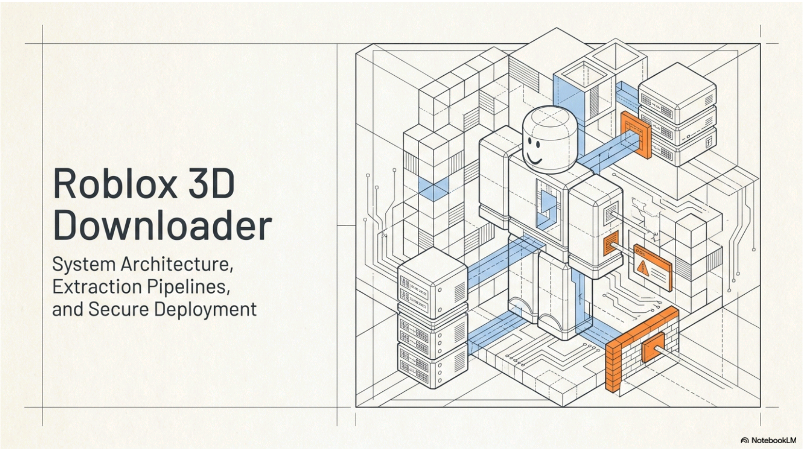
  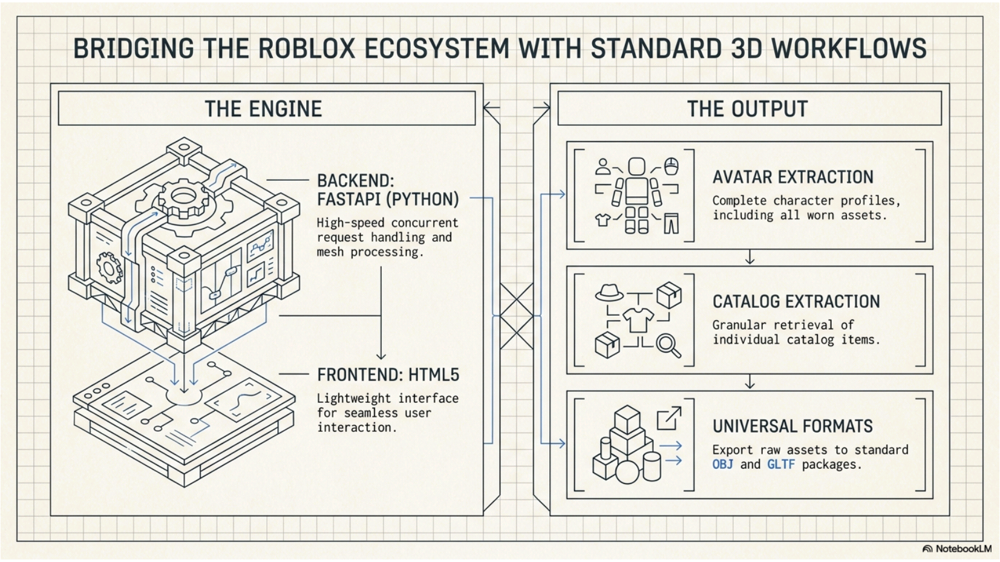
  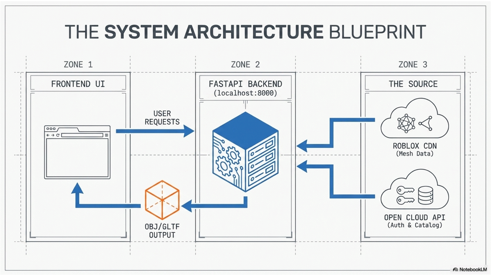
  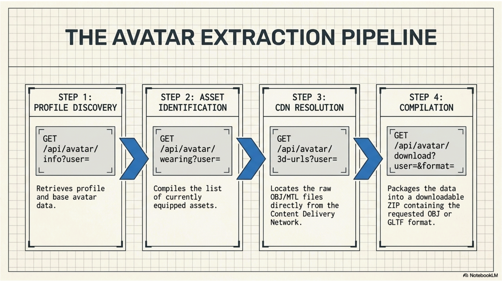
  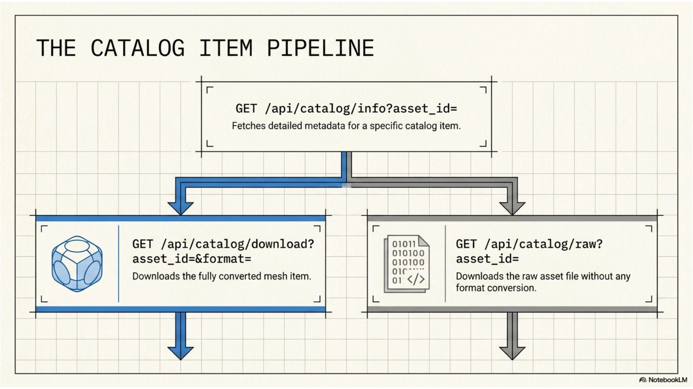
  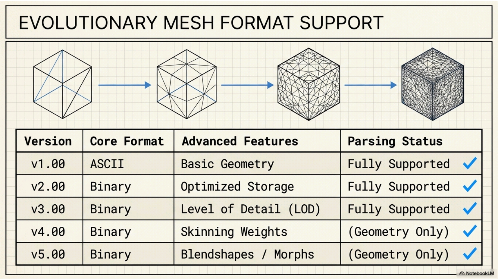
  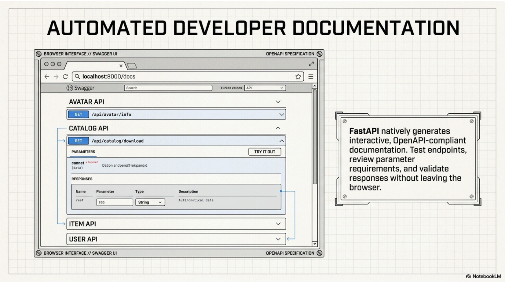
  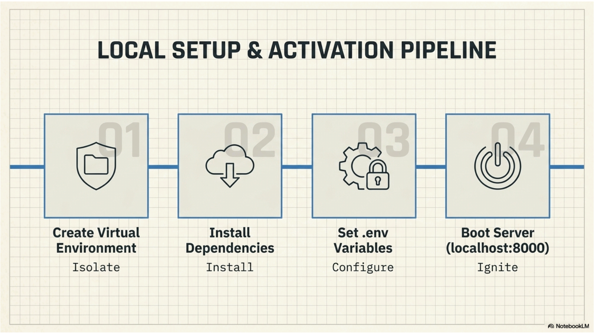
  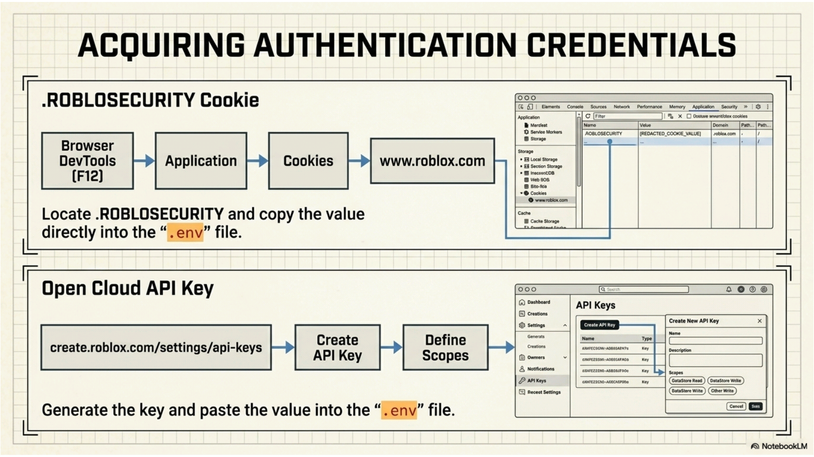
  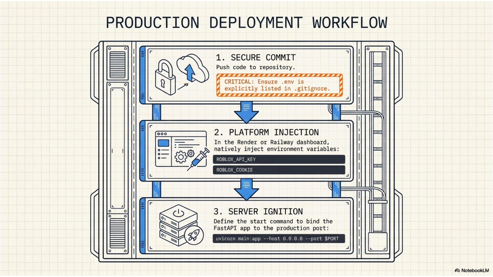
  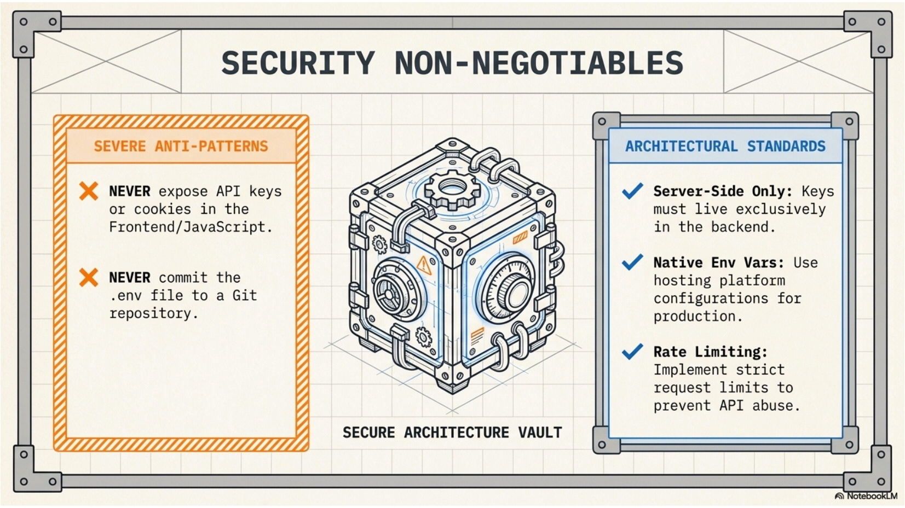
  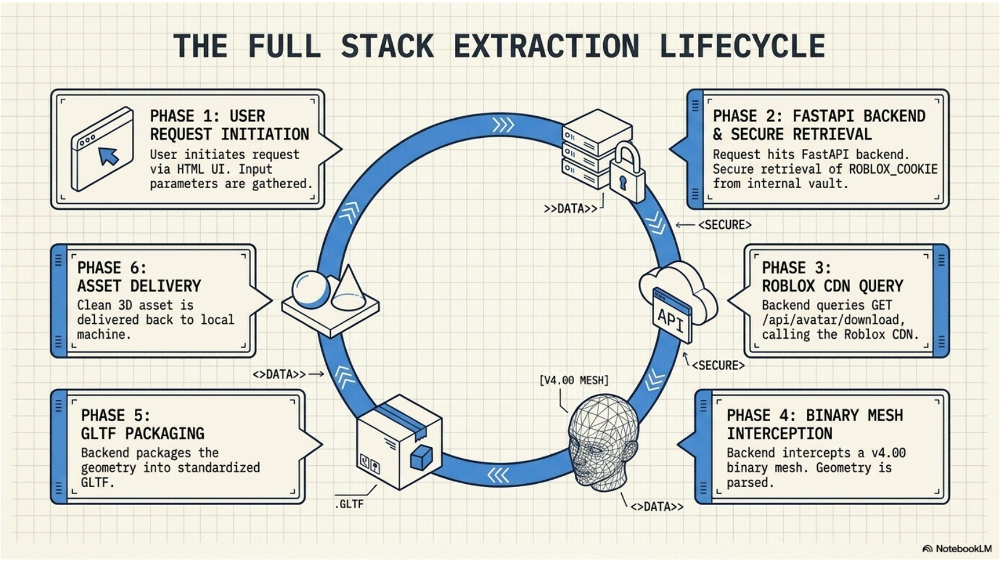
  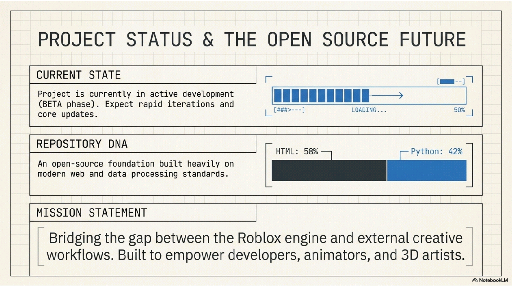
</div>